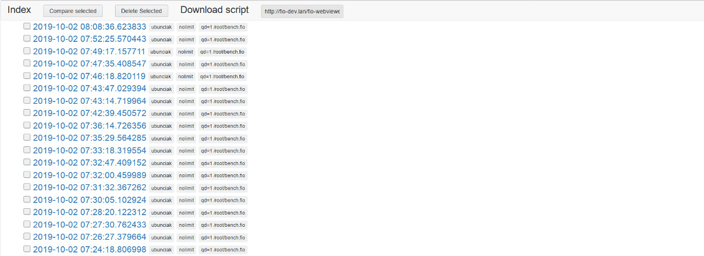
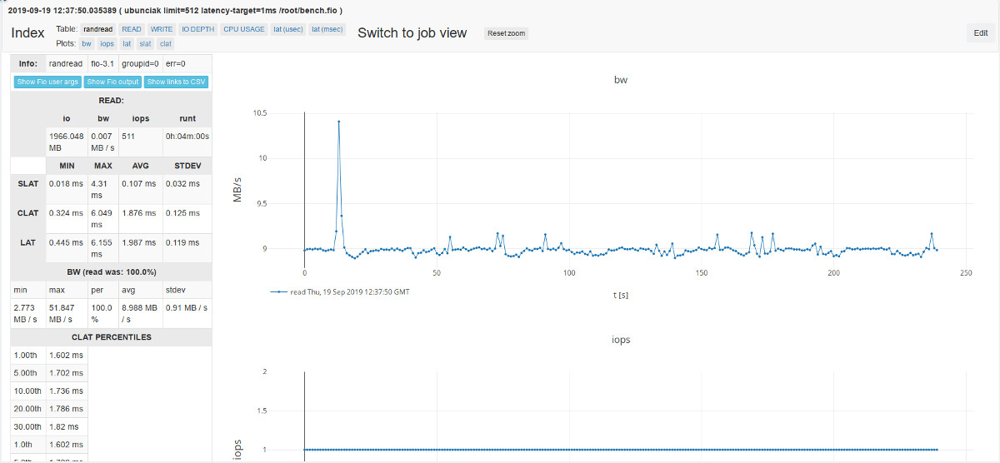
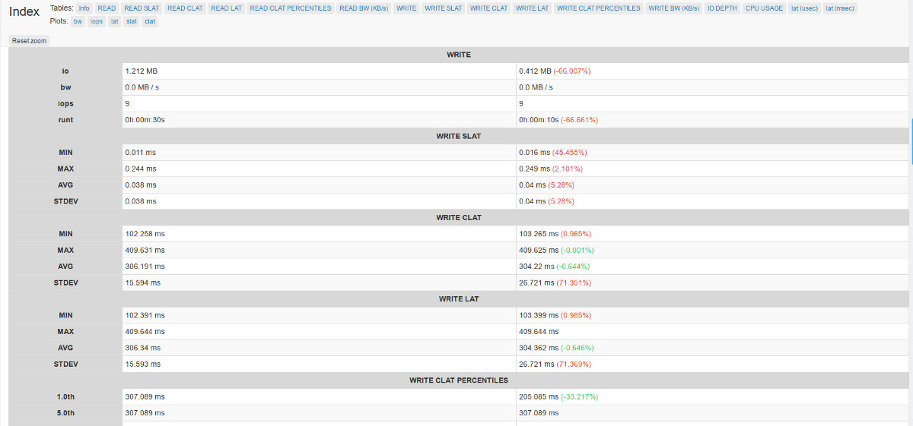

Fio web viewer
==========

This web applications allows to store, view and compare
 [fio](https://github.com/axboe/fio) results using a web interface.
 It is written in Python and is using Flask framework.
 Fio web viewer is released under modified BSD license. See [license](LICENSE).

# How does it work?

Running fio with `fio-webviewer.sh`  will create a temporary directory under
 `/tmp/` with fio logs. These logs will be sent to the fiowebviewer when
  fio finishes.  
The application processes and stores the fio logs and allows the user to view
 and compare different runs.
fio runs will appear on the main page of the application in a list,
 it is possible to name selected runs and add tags to them.

# How to use it?

## fio-webviewer.sh usage

To use `fio-webviewer.sh`, simply pass fio parameters as input arguments.
webviewer and fio options are optional, fio job parameters are required to run.
This script adds `--group_reporting` and `--log_avg_msec=1000`
 by default to all jobs.
If you want to override default aggregation set your own `--log_avg_msec=`
with desired value in script arguments.
To tag results in fiowebviewer, simply add
 `--webviewer-tag=example` or `--webviewer-tag example`.
If there is no `--webviewer-tag=` present, result will still be taged using
only hostname `(<hostname>)`.

## Web interface

Web interface has fio results listed on the main page with their name and
 with tags. The user is able to click on a particular fio run to view their
 details including plots for aggregated jobs, fio command line arguments
 and summary about the particular run.
 
 Main page:
 
 

The data granularity on the plots is automatically scaled. User is able to
 zoom the plots.
 
 Result page:
 
 

The user can select several fio runs and click the Compare button.
 The comparison page will be displayed, where the summary of compared
 and aggregated runs is displayed on the same plots.
 
 Compare page:
 
 

# Installation

## Requirements

### Python

This application requires python 3.5 or 3.6 so please make sure you have
 proper version installed!

### fio

This application supports fio version 3.8+

### Installation process

Installation process has been tested on Ubuntu 16.04 and 18.04.

It is best to install fiowebviewer inside the virtualenv and run it with
 [TwistedWeb](https://twistedmatrix.com/trac/wiki/TwistedWeb)

1. Please make sure you have virtualenv activated and Twisted
 installed with pip.

2. Download fiowebviewer wheel package and install it.

```bash
pip install fiowebviewer-1.0.0-py2.py3-none-any.whl
```

3. Create a config file eg. `config.cfg` - it's a standard Python file.

```
DATA_PATH = '/some/path/data/'
ERROR_LOG = '/some/path/log/error.log'
CACHE_PATH = '/some/path/cache/'
DATABASE = 'sqlite:////some/path/db/database.db'
```

4. Create directories configured in `config.cfg`

5. Initialize sqlite database. There is a `create_tables.py` script for
 that in the `examples/` directory of the repository.
For that you need to have environment variable `FIOWEBVIEWER_SETTINGS` set.

```
FIOWEBVIEWER_SETTINGS=/home/fiowebviewer/config.cfg; python create_tables.py
```

6. Run the application with Twisted (or any other way you want):

```bash
FLASK_APP=fiowebviewer; FIOWEBVIEWER_SETTINGS=/home/fiowebviewer/path/to/config.cfg; twistd -n web --wsgi fiowebviewer.application
```

# Development

## Requirements

Development requirements are in requirements-dev.txt. You can install them
 using pip in your virtual environment `pip install -r requirements-dev.txt`
This project is using:

* pytest - of course
* [isort](https://github.com/timothycrosley/isort)
You can run isort once installed on console by issuing `isort pythonfile.py`
 isort configuration file is .isort.cfg.
* requests
* [pylama](https://github.com/klen/pylama)

In order to run test you have to adjust your PYTHONPATH environment variable.

## environment variables

If you want to run application in DEBUG mode, run some tests or for example
 build a package, you have to set these environment variables:

```bash
export FLASK_APP=fiowebviewer
export FLASK_DEBUG=true
export FIOWEBVIEWER_SETTINGS=/path/to/config.cfg
export PYTHONPATH=/path/where/you/installed/fiowebviewer
```

## Flask debug mode

To start flask webserver in debug mode, first adjust environment variables:

```
export FLASK_DEBUG=true
```

Then run:

```bash
flask run --host=0.0.0.0
```

## Package creation

### Wheel package

Install dependencies in `requirements.txt` with

```bash
pip install -r requirements.txt
```

To create wheel package, simply run:

```bash
make bdist_wheel
```

Package can be found in `dist/` directory.
